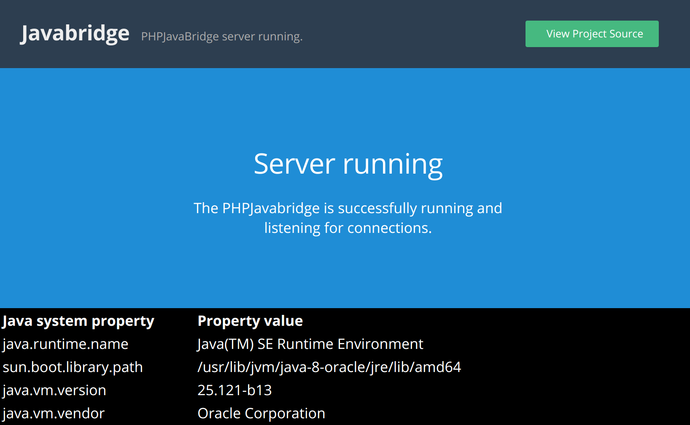

[](https://travis-ci.org/belgattitude/php-java-bridge)
[](https://maven-badges.herokuapp.com/maven-central/io.soluble.pjb/php-java-bridge)
[](https://github.com/belgattitude/php-java-bridge/blob/master/LICENSE.md)
(develop branch: 
[](https://travis-ci.org/belgattitude/php-java-bridge))

The soluble PHPJavaBridge server fork allows PHP/JVM interoperability through a local network protocol between both runtimes.

> Disclaimer: This fork is based on the robust and mature [sourceforge](https://sourceforge.net/p/php-java-bridge/code/) version made by Jost Boekemeier and 
> was refactored to ease installation process, promote contributions and embrace more modern practices found in 
> the Java ecosystem. To keep a track of differences, you can refer to the [fork status](./doc/notes_fork_status.md) page.   

## Installation

This repository can be used to develop, test and and build the JavaBridge server. 

Be sure to consult the [soluble-japha](https://github.com/belgattitude/soluble-japha) website 
where you'll find more information relative to php/jaba integration.  

 
## Documentation

- Soluble PHPJavaBridge server [API doc](http://docs.soluble.io/php-java-bridge/api).
- PHP `soluble-japha` client [documentation](https://github.com/belgattitude/soluble-japha)  

> Older documentation can be found in the [PHP/Java bridge](http://php-java-bridge.sourceforge.net/pjb/) site

## Releases

- You can download pre-compiled [java bridge binaries](https://github.com/belgattitude/php-java-bridge/releases) on the releases page (jdk8). 
- Major releases are published on [Maven central](https://search.maven.org/#search%7Cga%7C1%7Cio.soluble.pjb.php-java-bridge).

  With maven:
    
  ```
  <dependency>
     <groupId>io.soluble.pjb</groupId>
      <artifactId>php-java-bridge</artifactId>
     <version>x.y.z</version>
  </dependency>
  ```
    
  or gradle
    
  ```
  compile 'io.soluble.pjb:php-java-bridge:x.y.z'
  ```

To register the PHPJavaServlet, you can have a look to the example [web.xml](https://github.com/belgattitude/php-java-bridge/blob/master/src/main/webapp/WEB-INF/web.xml) file.


## Build the project

### Requirements

 - Oracle JDK 7,8
 - Optionally `ant` for old Java.inc generation
 
### Get the sources

You can either clone the project with:

```shell
$ git clone https://github.com/belgattitude/php-java-bridge.git
```

or download a zip tarball from the github page.

### Gradle build 

Build the project with the provided gradle wrapper:

```shell
$ cd php-java-bridge
$ ./gradlew build 
```

The generated files are available in the  `/build/libs` folder:

| File          | Description   | 
| ------------- | ------------- | 
| `php-java-bridge-<VERSION>.jar`  | JavaBridge library (servlet and standalone). | 
| `php-java-bridge-<VERSION>-sources.jar`  | Source code. | 
| `php-java-bridge-<VERSION>-javadoc.jar`  | Generated api doc. |

Additionally a generic template file is automatically generated: 

| File          | Description   | 
| -------------| ------------- | 
| `JavaBridgeTemplate.war`  | A ready to deploy war example file. |

 
### Adding deps to the builded '.war'
 
Instead of modifying directly the main `build.gradle` file, you should consider using 
init-scripts. Examples can be found on the [init-scripts doc](./init-scripts/README.md). 

                                                                                                                 
## Usage

> Currently only tested on Tomcat 7/8, should be running on any servlet 2.5 compatible container.

### Servlet registration

You can have a look to the [web.xml](https://github.com/belgattitude/php-java-bridge/blob/master/src/main/webapp/WEB-INF/web.xml) default configuration
for the servlet configuration settings. 

### Deploy

Ensure you have a [Tomcat server](./docs/install/install_tomcat.md) installed.

And copy the ready to run `JavaBridgeTemplate.war` in the tomcat webapps folder:

```shell
$ sudo cp ./build/libs/JavaBridgeTemplate.war /var/lib/tomcat8/webapps/JavaBridgeTemplate.war
```

Wait few seconds for deployment and point your browser to [http://localhost:8080/JavaBridgeTemplate](http://localhost:8080/JavaBridgeTemplate), you should see the
bridge landing page :




Have a look to the error log if needed:

```shell
$ cat /var/log/tomcat8/catalina.out
```

## Develop

For development, the use of the `./gradlew tomcatRun` and `./gradlew tomcatStop` allows testing 
without the need of deployment.

Dependencies can be added in the `build.gradle` file.   

## FAQ

### OutOfMemory errors under Tomcat

If you get OutOfMemory errors, you can increase the java heap tomcat:

```shell
$ sudo vi /etc/default/tomcat8
```

Look for the Xmx default at 128m and increase 

```
JAVA_OPTS="-Djava.awt.headless=true -Xmx512m -XX:+UseConcMarkSweepGC"
```

and restart

```shell
$ sudo service tomcat8 restart
```
 
## Contribute

Feel free to fork and submit pull requests :)

## Credits

Original developers:

- Jost Boekemeier
- Andre Felipe Machado, 
- Sam Ruby, 
- Kai Londenberg, 
- Nandika Jayawardana, 
- Sanka Samaranayake, 

Forked version

- [Christian P. Lerch](https://github.com/cplerch): Java refactorings and modernizations. 
- [Sébastien Vanvelthem](https://github.com/belgattitude): Fork initiator and maintainer.

See the [CREDITS.md](./CREDITS.md) for an up to date of list of contributors.